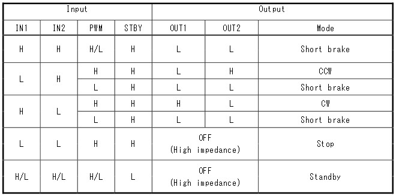
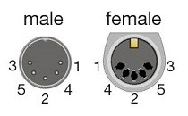

# ValveController
This project implements a motorized ball valve controlled by a Raspberry Pi Zero W.

The motorized ball valve I chose for this project is a U.S. Solid USS-MSV00016 , available from Amazon.com.

The pinouts for this valve are:

*	Blue and Yellow:  +9-24 VDC to Yellow and Ground to Blue opens the valve.  +9-24 VDC to Blue and Ground to Yellow closes the valve.

*	Red, Black, and Green:  When the valve is closed, Red is connected to Black.  When the valve is open, Green is connected to Black.

The processor is a Raspberry Pi Zero W.  It has the following features relevant to this project:

*	1GHz, single-core CPU

*	512MB RAM

*	Micro USB power connector

*	HAT-compatible 40-pin header

*	802.11 b/g/n wireless LAN

I used a 16 Gbyte microSD memory card for OS and program storage.  An 8 Gbyte card would probably have sufficed.

## Configuration Instructions

### Part I:  Configure the Raspberry Pi Zero W software.

1.	Download an image of Raspian Buster from https://www.raspberrypi.org/downloads/raspbian/ .  Burn the image onto a microSD card using a tool such as ImageWriter’s Win32DiskImager.

2.	Using the PC, create wpa_supplicant.conf in the Boot folder of the microSD card as follows:
```
ctrl_interface=DIR=/var/run/wpa_supplicant GROUP=netdev    
update_config=1    
country=US    

network={    
	ssid="yourSSID"      
	psk="yourWiFiPassword"      
	scan_ssid=1      
}
```
3.	Using the PC, create an empty file called ‘ssh’ (no extension) in the Boot folder of the microSD card.

4.	Plug the microSD card into the Pi Zero W and power up the board.

5.	After allowing enough time for boot configuration, use Advanced IP Scanner or equivalent (e.g., look at connected devices on the router) to discover the IP address the router assigned to the Pi Zero W.

6.	Connect to the Pi Zero W using PuTTY on port 22 of the Pi Zero W’s IP address.

7.	Log in to Raspbian Buster using the default username ‘pi’ and password ‘raspberry’.

8.	Update the Raspbian Buster OS using the following two commands:
```
sudo apt-get update
sudo apt-get dist-upgrade
```
9.	Use `sudo reboot` to reboot the Pi Zero W.  Log in using username ‘pi’ and the password ‘raspberry’.

10.	Set up the Pi Zero W to have a static IP address on your LAN.  Use `sudo nano /etc/dhcpcd.conf` to edit dhcpcd.conf to add the following lines to the bottom of the file, where XXX represents the desired last digits of the IP address you want:
```
interface wlan0
static ip_address=192.168.1.XXX/24
static routers=192.168.1.1
static domain_name_servers=192.168.1.1

# define static profile using wlan0
profile static wlan0
static ip_address=192.168.1.35/24
static routers=192.168.1.1
static domain_name_servers=192.168.1.1

# fallback to static profile on wlan0
interface wlan0
fallback static_wlan0
```

11.	Use `sudo raspi-config` and change the password and timezone of the board.  Also change the Hostname under Network Options to ‘ValveController’.  This will launch the raspi-config utility. Then use `sudo reboot` to reboot the Raspberry Pi Zero W.  The Raspberry Pi will reboot with the new password for user pi and the new Hostname.

12.	Connect to the Pi Zero W using PuTTY on port 22 of the board’s new IP address.  Log in using username ‘pi’ and the password you entered in step 11.

### Part II:  Application Software
13.	There are two valve control programs, and one to monitor and report the status of the valve.  One valve control program, [valve_web.py](src/valve_web.py), provides a web-based interface to open and close the valve and report the status of the valve.  The other valve control program, [valve_control.py](src/valve_control.py), is meant to be run as a cron task and accepts a command-line argument as to whether open or close the valve.  An example [crontab](src/crontab) listing is provided in the src folder.  The valve monitoring and reporting program, [valve_monitor.py](src/valve_monitor.py), is meant to be run as a background service.  It is supported by a state machine library in [state_machines.py](src/state_machines.py) that is used to debounce the Open and Closed contact closure signals from the valve.  An email handler, [email_handler.py](src/email_handler.py), is used to facilitate sending status message emails.  These five programs are written in Python 3, and tested under Python 3.7.  An email settings file, [settings.ini](src/settings.ini), contains the email server and addressing information necessary to send email messages.
Place the five Python 3 program files and settings.ini in the Raspberry Pi Zero W pi user’s directory, in a subfolder called “valve_control” (i.e., /usr/pi/valve_control).  Make valve_web.py, valve_control.py, and valve_monitor.py executable using the chmod command:
```
chmod 755 valve_web.py
chmod 755 valve_control.py
chmod 755 valve_monitor.py
```
14.	Set up valve_monitor.py as a service that will run automatically on power-up.  Copy the [valve_status.service](src/valve_status.service) script to /etc/systemd/system/valve_status.service.  Enable the service using 
`sudo systemctl enable valve_status.service`.
Reboot the Raspberry Pi Zero W using 
`sudo reboot`.  
Then use
`sudo systemctl status valve_status.service` 
to check to see that the service is running.
15.	Edit a crontab file using
`crontab -e`.
An [example crontab file](src/crontab) is provided in the src folder.  The last two lines in the crontab listing turn the valve on at 0515 and off at 0645 on Tuesdays and Fridays in the months May through October.

### Part III:  Hardware Interface
I chose to use a pre-assembled H-Bridge breakout board to drive the valve motor.  The board I chose is an [Adafruit TB6612 1.2A DC/Stepper Motor Driver Breakout Board](https://learn.adafruit.com/adafruit-tb6612-h-bridge-dc-stepper-motor-driver-breakout), Adafruit Industries product ID 2448.  A schematic diagram of this board is provided [here, by Adafruit Industries](https://learn.adafruit.com/assets/24267). 

The Toshiba TB6612 logic is shown in the table below:



I mounted a prototyping daughter board on the Raspberry Pi Zero W, and mounted the Adafruit TB6612 Breakout Board on the daughter board.  I connected the Raspberry Pi Zero W GPIO pins to the Adafruit TB6612 Breakout Board as follows:

Function|Raspberry Pi Zero W Pin|Adafruit TB6612 Breakout Board Pin
----------------------------|-----|----------------------------------
AIN1=H, AIN2=L:  Open Valve|BCM5|AIN1
AIN1=L, AIN2=H:  Close Valve|BCM6|AIN2
PWM=L:  Short Brake|BCM13|PWMA

### Part IV:  Controller to Valve Wiring.
I chose a 5-pin DIN connector for the wiring between the controller and the valve.  The pinouts for such a connector are as shown in the figure below:



The pins are assigned as follows:

Function|Controller|DIN Connector|Cable Wire Color|Valve
--------|----------|-------------|----------------|-----
12V +/-|Motor A-1|1|White|Yellow Wire
12V -/+|Motor A-2|3|Blue|Blue Wire
Valve Open|BCM 14 (TXD)|4|Green|Green Wire
Valve Closed|BCM 15 (RXD)|5|Red|Red Wire
Ground|Ground|2|Braid|Black Wire

I purchased a cable from Amazon called a “Monoprice MIDI Cable – 25 Feet – Black with Keyed 5-Pin DIN Connector Molded Connector Shells,” which unfortunately came wired with a different pin-to-wire-color mapping, so I ended up rewiring the plug on the Raspberry Pi end.  If I had it to do over again, I would have used the cable, which maps as follows, as-is:

DIN Connector|Cable Wire Color
-------------|----------------
1|White
3|Red
4|Blue
5|Green
2|Braid

I cut the connector off the valve end of the cable and hardwired the cable to the wires on the valve, i.e., I did not use a connector on the valve end of the cable. 
